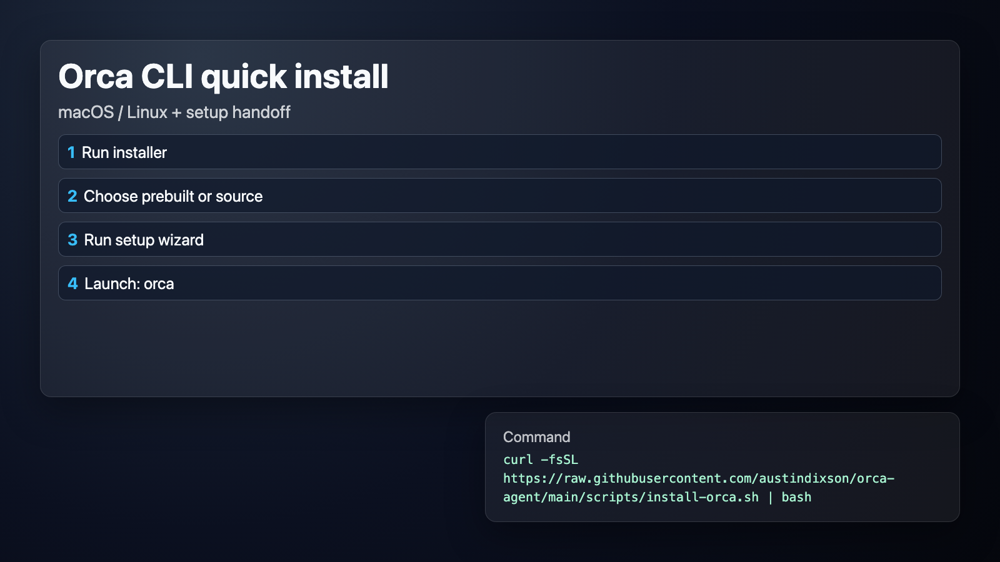
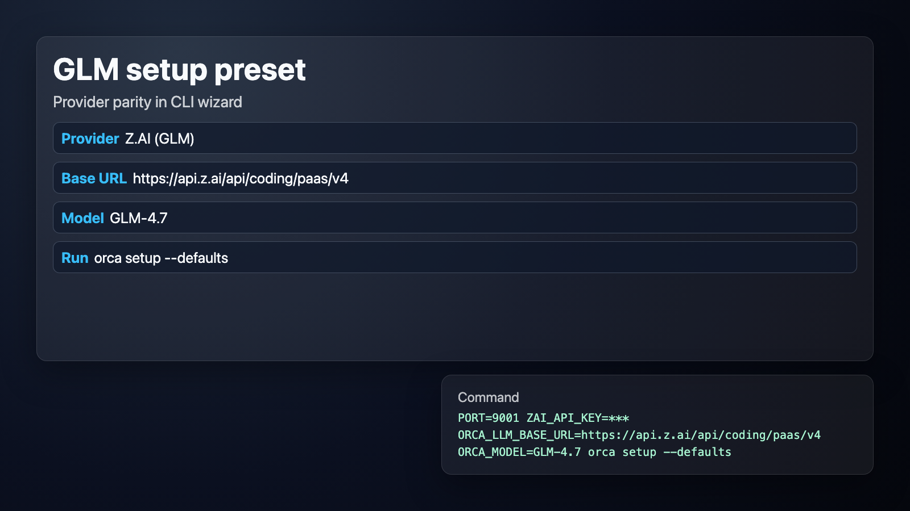

# orca-agent

Standalone Orca terminal agent repository (CLI/TUI).

## Visual quickstart





Included:
- `crates/orca-cli` (`orca` binary)
- `scripts/install-orca.sh` (dual-mode installer: prebuilt or source)
- `.github/workflows/ci.yml` (build/test CI)
- `.github/workflows/release.yml` (release binary artifacts)

## Install

One-command installer:

```bash
curl -fsSL https://raw.githubusercontent.com/austindixson/orca-agent/main/scripts/install-orca.sh | bash
```

Installer modes:
- interactive prompt (default): choose prebuilt binaries or source build
- env override:

```bash
ORCA_INSTALL_MODE=binary  # binary|source|auto|prompt
ORCA_VERSION=latest       # or v0.1.0
ORCA_GITHUB_REPO=austindixson/orca-agent
```

## Helpful command examples

Quick setup with Z.AI GLM defaults:

```bash
PORT=9001 \
ZAI_API_KEY='your_key_here' \
ORCA_LLM_BASE_URL='https://api.z.ai/api/coding/paas/v4' \
ORCA_MODEL='GLM-4.7' \
orca setup --defaults
```

Interactive setup also includes a Z.AI endpoint picker:
- Coding Plan endpoint: `https://api.z.ai/api/coding/paas/v4`
- Standard endpoint: `https://api.z.ai/api/paas/v4`

After you enter an API key, setup now attempts to auto-detect models from that provider and presents a selectable model list (with manual fallback).

Daily commands:

```bash
orca            # open full-screen TUI chat
orca status     # daemon / bridge / gateway health
orca doctor     # config + runtime checks
orca chat "summarize latest changes"
orca logs
```

## Local development

```bash
cargo build -p orca-cli
cargo run -p orca-cli -- --help
cargo test -p orca-cli
```

Run setup wizard:

```bash
cargo run -p orca-cli -- setup
```

## Windows install (robust path)

The one-line `curl | bash` installer is for macOS/Linux shells.

On Windows, use one of these:

1) Native PowerShell (recommended)
- Download latest release ZIP from:
  - https://github.com/austindixson/orca-agent/releases/latest
  - Asset: `orca-agent-windows-x86_64.zip`
- Extract to a stable folder, e.g.:
  - `%LOCALAPPDATA%\Programs\orca-agent\`
- Add that folder to your User PATH.
- Open a new PowerShell and verify:

```powershell
orca --help
```

- Run setup:

```powershell
orca setup
```

2) WSL path
- In WSL, run the standard installer:

```bash
curl -fsSL https://raw.githubusercontent.com/austindixson/orca-agent/main/scripts/install-orca.sh | bash
```

- Then run `orca setup` in WSL.

Windows notes:
- Daemon registration uses Task Scheduler (`orca install` creates a user logon task).
- Logs are at `%LOCALAPPDATA%\Orca\Logs\orcad.log`.

## Release assets

When you push a tag like `v0.1.0`, GitHub Actions builds release archives:
- `orca-agent-linux-x86_64.tar.gz`
- `orca-agent-darwin-x86_64.tar.gz`
- `orca-agent-darwin-aarch64.tar.gz`
- `orca-agent-windows-x86_64.zip`

The installer can download these directly in binary mode (macOS/Linux), and Windows users can install from the ZIP release asset.

## Regenerate README visuals (Remotion)

The images in `docs/assets/*.png` are generated via Remotion from `docs/remotion`.

```bash
cd docs/remotion
npm install
npm run compositions
npm run render:all
```

This updates:
- `docs/assets/install-flow.png`
- `docs/assets/setup-flow.png`
